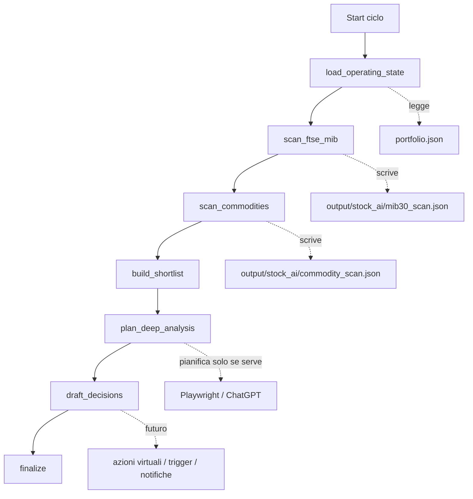
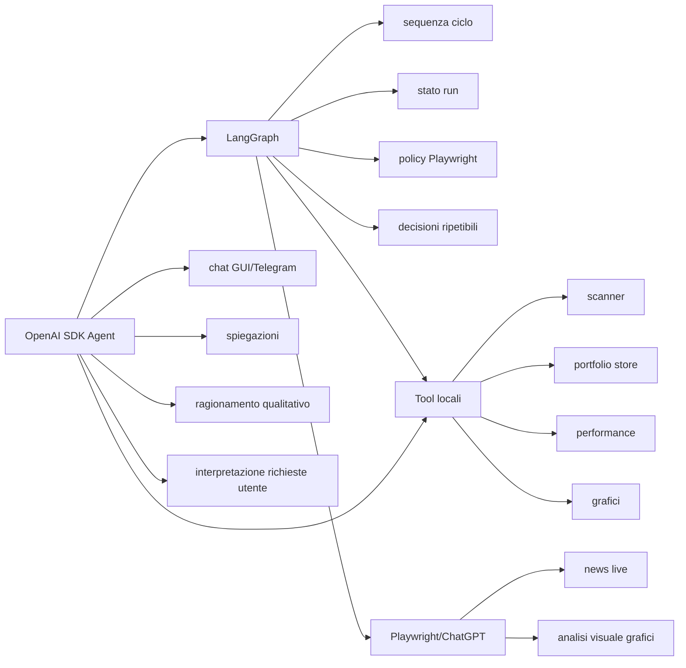

# Autonomous Trading Agent

Portafoglio virtuale con trading automatico, monitoraggio trigger, analisi tecnica, news via Playwright/ChatGPT, notifiche Telegram e dashboard React.

Il progetto e pensato per simulazione, studio e monitoraggio operativo. Non invia ordini reali a broker e non e consulenza finanziaria.

## Cosa fa

- Gestisce un portafoglio virtuale salvato in `portfolio.json`.
- Monitora posizioni aperte, P/L, cash, esposizione e performance storica.
- Scannerizza due mercati:
  - FTSE MIB da `validTickers/validtickers_IT_MIB30_with_sector.xlsx`
  - Materie prime / ETC da `validTickers/MateriePrime.xlsx`
- Filtra i candidati con indicatori tecnici locali e controlli di liquidita.
- Approfondisce solo i candidati interessanti con Playwright/ChatGPT.
- Usa le news live via Playwright per supportare le decisioni operative.
- Crea condizioni monitorate con scenari di ingresso.
- In modalita autonoma virtuale puo comprare, vendere, ridurre e ribilanciare il portafoglio virtuale.
- Notifica l'utente via Telegram secondo la policy configurata.
- Espone una GUI React con dashboard, watchlist, chat agente, grafici e log run.

## Principio operativo

Il sistema separa tre livelli:

1. **Calcolo locale**
   Scarica dati da Yahoo Finance, calcola indicatori, score, livelli, liquidita, performance e trigger.

2. **Playwright/ChatGPT nel browser**
   Viene usato per news live e conferme visuali dei grafici. Richiede Chrome aperto con debug remoto e login ChatGPT gia valido.

3. **OpenAI SDK Agent**
   Coordina le decisioni, sceglie quali tool chiamare, sintetizza i risultati e decide le azioni sul portafoglio virtuale. Usa `OPENAI_API_KEY`.

L'obiettivo e usare l'API OpenAI solo per orchestrare l'agente, non per fare tutto il lavoro pesante di news e analisi visuale.

## Architettura

```text
agent_portfolio_manager.py        # CLI principale e agente OpenAI SDK
langgraph_portfolio_manager.py    # prototipo workflow LangGraph
langgraph_agent/                  # nodi e stato condiviso del grafo
playwright_monitor.py             # monitor Playwright-first, meno consumo API
chatgpt_playwright_demo.py        # news/report via ChatGPT nel browser
stock_chart_ai_analysis.py        # grafici + analisi visuale ChatGPT via Playwright

backend/main.py                   # API FastAPI per dashboard React
frontend/                         # UI React/Vite

finance_charts/                   # indicatori e dati grafico
finance_tools/                    # tool portfolio, scanner, news, chart, Telegram
scripts/                          # scheduler Windows e launcher
validTickers/                     # universi ticker
logs/                             # log schedulati e Telegram bot
output/                           # grafici, analisi e cache news
```

## Architettura LangGraph proposta

Il branch `codex/langgraph-review` introduce un prototipo LangGraph per rendere il ciclo operativo piu prevedibile. L'idea e spostare la sequenza decisionale dal solo prompt dell'agente a un grafo esplicito, dove ogni nodo ha input, output e responsabilita chiare.

### Vista logica del grafo



### Sequenza prevedibile

| Ordine | Nodo | Cosa fa | Usa API OpenAI? | Usa Playwright? |
|---:|---|---|---|---|
| 1 | `load_operating_state` | Legge portafoglio, posizioni, cash, trigger, performance. | No | No |
| 2 | `scan_ftse_mib` | Calcola indicatori locali sui titoli FTSE MIB. | No | No |
| 3 | `scan_commodities` | Calcola indicatori locali su Materie prime/ETC. | No | No |
| 4 | `build_shortlist` | Unisce i candidati liquidi e ordina per score. | No | No |
| 5 | `plan_deep_analysis` | Decide quali ticker meritano approfondimento. | No | Non lo esegue, lo pianifica |
| 6 | `draft_decisions` | Produce decisioni preliminari: monitor, candidate, hold. | No nella prima versione | No |
| 7 | `finalize` | Crea riepilogo finale e stato leggibile. | No | No |

### Regole di prevedibilita

- FTSE MIB e Materie prime vengono analizzati come mercati separati.
- Lo scan iniziale e sempre locale: Yahoo Finance, indicatori tecnici, liquidita, supporti/resistenze.
- Gli strumenti con liquidita bassa restano visibili nei risultati, ma non entrano nei candidati operativi.
- Lo score serve solo a creare una short-list, non equivale a comprare.
- Playwright non viene usato sul file Excel completo.
- Playwright viene usato solo se il ticker e:
  - gia in portafoglio;
  - vicino a un trigger di uscita;
  - con trigger di ingresso scattato;
  - buy candidate liquido con score forte;
  - richiesto esplicitamente dall'utente.
- Ogni decisione deve riportare:
  - mercato;
  - ticker;
  - score;
  - liquidita;
  - trigger coinvolto;
  - motivo tecnico;
  - eventuale motivo news/grafico;
  - azione proposta o applicata.

### Responsabilita tra LangGraph e OpenAI SDK Agent



La direzione consigliata e:

- **LangGraph** come motore operativo autonomo e schedulato.
- **OpenAI SDK Agent** come interfaccia conversazionale per GUI e Telegram.
- **Playwright/ChatGPT** come approfondimento selettivo per news e grafici.
- **Tool locali** come fonte primaria per dati numerici, score, liquidita e portafoglio.

### Esempio di log atteso

Il log ideale deve spiegare il ciclo senza dover leggere il codice:

```text
2026-07-25 09:00:00 [run 20260725-090000] START scheduled
2026-07-25 09:00:02 [run 20260725-090000] node=scan_ftse_mib universe=40
2026-07-25 09:00:08 [run 20260725-090000] ticker=AMP.MI score=8 liquidity=ok candidate=yes reason="MACD sopra signal; DI+ sopra DI-"
2026-07-25 09:00:11 [run 20260725-090000] ticker=GBS.MI score=4 liquidity=low candidate=no reason="volume medio sotto soglia"
2026-07-25 09:00:30 [run 20260725-090000] playwright_plan ticker=HER.MI reason="posizione aperta; controllo uscita"
2026-07-25 09:01:20 [run 20260725-090000] action=buy_virtual_position ticker=HER.MI amount=2000 reason="trigger pullback support confirmed"
2026-07-25 09:01:25 [run 20260725-090000] END ok duration=85s
```

### Test del prototipo LangGraph

Test veloce con pochi strumenti:

```powershell
C:\Users\theoi\anaconda3\envs\openaiAgent\python.exe langgraph_portfolio_manager.py --scan-limit 2 --universe-limit 3
```

Output completo JSON:

```powershell
C:\Users\theoi\anaconda3\envs\openaiAgent\python.exe langgraph_portfolio_manager.py --scan-limit 2 --universe-limit 3 --json
```

Documentazione di dettaglio:

```text
docs/architecture-langgraph-analysis.md
docs/langgraph-roadmap.md
```

## Mercati supportati

### FTSE MIB

Il file principale e:

```text
validTickers/validtickers_IT_MIB30_with_sector.xlsx
```

Lo scanner FTSE MIB analizza i ticker italiani, calcola score tecnico, rischi, supporti, resistenze e liquidita.

### Materie prime / ETC

Il file principale e:

```text
validTickers/MateriePrime.xlsx
```

Gli strumenti commodity vengono trattati come universo separato. Sono spesso ETC/ETN quotati a Milano, quindi l'agente considera:

- liquidita;
- volatilita;
- rischio specifico dello strumento;
- esposizione massima commodity;
- news non negative;
- trigger tecnico confermato.

In dashboard i trigger sono divisi tra **FTSE MIB**, **Materie prime / ETC** e **Altri strumenti e watchlist**.

## Scoring e filtri

Gli scanner calcolano indicatori tecnici locali, tra cui:

- RSI
- MACD e signal
- Stocastico
- Williams %R
- ADX, DI+ e DI-
- volumi e volume MA10
- supporti e resistenze recenti
- variazione giornaliera

Lo score serve solo per creare una short-list. Non e un ordine di acquisto.

Prima di diventare operativo, un candidato deve superare anche:

- liquidita minima;
- distanza ragionevole dal trigger;
- volumi non contrari;
- news non negative;
- eventuale conferma grafica via Playwright se il caso e vicino a una decisione.

## Scenari di ingresso

Le condizioni monitorate usano scenari strutturati. Questo permette all'agente di decidere senza basarsi solo su testo libero.

### BREAKOUT

Ingresso solo su chiusura sopra una resistenza/trigger con volumi almeno in recupero o sopra MA10.

Esempio:

```text
SCENARIO BREAKOUT: chiusura sopra 11.80 con volumi in recupero o sopra MA10; invalidazione sotto 10.57
```

### PULLBACK_SUPPORTO

Ingresso vicino al supporto solo se il supporto tiene e compare una reazione positiva.

Esempio:

```text
SCENARIO PULLBACK_SUPPORTO: ingresso in area 10.57-10.83 solo su tenuta/rimbalzo del supporto, stop sotto 10.44 e news non negative
```

Il semplice arrivo vicino al supporto non basta per comprare. Servono tenuta/rimbalzo, volumi non contrari, liquidita adeguata e news non negative.

### Stati scenario

Gli scenari possono avere questi stati:

```text
WAIT              # non vicino al trigger
NEAR_TRIGGER      # vicino, ma non ancora confermato
CONFIRMING        # filtro numerico ok, serve Playwright/news
BUY_CANDIDATE     # confermato, l'agente puo decidere acquisto
BOUGHT            # scenario usato per acquisto virtuale
INVALIDATED       # contesto non piu valido
```

## Modalita operative

### Interattiva

Da PyCharm o CLI:

```bash
python agent_portfolio_manager.py --interactive
```

Esempi:

```text
mostra stato operativo
scannerizza 5 titoli FTSE MIB e dimmi i migliori
scannerizza le materie prime e dimmi i migliori
analizza VOD.L con news live
rivaluta condizioni monitorate
mostra performance
aggiungi VOD.L alla watchlist con priorita high
```

In modalita interattiva l'agente crea proposte pending e aspetta conferma utente, salvo comandi locali espliciti gia gestiti dal sistema.

### Autonoma virtuale

```bash
python agent_portfolio_manager.py --autonomous-monitor --once --scan-limit 5
```

In questa modalita l'agente puo applicare operazioni simulate sul solo `portfolio.json`:

- buy;
- sell;
- reduce;
- ribilanciamento;
- aggiornamento condizioni;
- invalidazione trigger;
- notifica Telegram.

Non fa ordini reali.

Limiti principali:

- `MAX_AUTO_TRADE_PCT`: percentuale massima del cash usabile per una nuova operazione;
- `MAX_COMMODITY_ALLOCATION_PCT`: esposizione indicativa massima su commodity/ETC;
- liquidita obbligatoria;
- news non negative;
- Playwright solo sui candidati da confermare, non su tutto l'universo.

## Setup

Installa dipendenze nell'ambiente Python, per esempio `openaiAgent`:

```bash
pip install -r requirements.txt
playwright install chromium
copy .env.example .env
```

Compila `.env` con i valori reali.

Variabili principali:

```env
OPENAI_API_KEY=your_openai_api_key_for_agent_only
OPENAI_AGENT_MODEL=gpt-5-mini
OPENAI_AGENT_MAX_TURNS=35
OPENAI_PERIODIC_MAX_TURNS=80

MONITOR_INTERVAL_MINUTES=30
MARKET_MONITOR_START_HOUR=9
MARKET_MONITOR_END_HOUR=21

MAX_AUTO_TRADE_PCT=25
MAX_COMMODITY_ALLOCATION_PCT=20

MIN_EQUITY_AVG_VOLUME=100000
MIN_COMMODITY_AVG_VOLUME=5000
MIN_LIQUIDITY_TURNOVER_EUR=100000

BREAKOUT_NEAR_PCT=3
PULLBACK_ENTRY_DISTANCE_PCT=2.5
PULLBACK_STOP_BUFFER_PCT=1.2
MIN_CONFIRM_VOLUME_RATIO=0.8

TELEGRAM_BOT_TOKEN=your_telegram_bot_token
TELEGRAM_RECEIVER_ID=your_telegram_chat_id
```

`OPENAI_AGENT_MAX_TURNS` vale per chat e richieste normali.
`OPENAI_PERIODIC_MAX_TURNS` vale per il monitor periodico, che usa piu tool.

## Chrome con debug remoto

Per news live e analisi Playwright, apri Chrome cosi:

```cmd
"C:\Program Files\Google\Chrome\Application\chrome.exe" --remote-debugging-port=9222 --user-data-dir="%TEMP%\chatgpt-cdp-profile"
```

Poi entra su ChatGPT e verifica di essere loggato.

Il sistema usa Playwright solo quando serve:

- news live di un ticker operativo;
- conferma visuale del grafico;
- candidato vicino a trigger;
- posizione in portafoglio da ridurre/vendere;
- decisione autonoma da motivare.

Non deve usare Playwright per ogni titolo del file Excel.

## Dashboard React + FastAPI

Avvia backend:

```bash
python -m uvicorn backend.main:app --host 127.0.0.1 --port 8000 --reload
```

Avvia frontend:

```bash
cd frontend
npm install
npm run dev
```

Apri:

```text
http://127.0.0.1:5174
```

API docs:

```text
http://127.0.0.1:8000/docs
```

La dashboard mostra:

- stato agente;
- ultimo ciclo completato;
- prossimo ciclo atteso;
- capitale, cash, valore portafoglio e P/L;
- rendimento giornaliero del portafoglio;
- posizioni aperte con variazione giornaliera;
- condizioni di uscita;
- trigger di ingresso divisi per mercato;
- watchlist manuale;
- grafici prezzo, volumi, RSI/Stoch/Williams, MACD, ADX;
- chat stile ChatGPT;
- azioni recenti;
- run log;
- controlli Telegram e monitor.

Endpoint principali:

```text
GET  /api/dashboard
GET  /api/ftse-mib
POST /api/ftse-mib/scan
GET  /api/commodities
POST /api/commodities/scan
GET  /api/chart/{ticker}
GET  /api/watchlist
POST /api/watchlist
POST /api/agent/chat
POST /api/agent/run-once
POST /api/playwright-monitor/run
POST /api/agent/analyze-watchlist-entry-conditions
GET  /api/run-logs
GET  /api/telegram/settings
POST /api/telegram/settings
```

## Watchlist manuale

La watchlist contiene ticker scelti dall'utente, anche se non filtrati dallo scanner.

Dalla GUI puoi:

- aggiungere ticker;
- impostare priorita;
- inserire motivo;
- inserire una condizione di ingresso;
- chiedere all'AI di impostare condizioni;
- aprire grafici;
- rimuovere ticker.

Nel ciclo periodico l'agente considera anche la watchlist. Se manca una condizione di ingresso, puo proporne una con scenario `BREAKOUT` o `PULLBACK_SUPPORTO`.

## Portafoglio virtuale

Inizializza:

```bash
python agent_portfolio_manager.py --init-portfolio --capital 20000
```

Mostra stato:

```bash
python agent_portfolio_manager.py "mostra stato operativo"
```

Aggiorna capitale:

```bash
python agent_portfolio_manager.py "aggiorna il capitale a 20000 euro"
```

In interattivo:

```text
compriamo 10000 euro di HER.MI
conferma proposta 20260724-003101
rifiuta proposta 20260724-003101
```

In modalita autonoma virtuale l'agente puo invece applicare da solo operazioni virtuali, rispettando i limiti configurati.

## Scheduler Windows

Installa il task:

```powershell
powershell -ExecutionPolicy Bypass -File scripts\install_windows_monitor_task.ps1
```

La task Windows esegue:

```text
scripts\run_autonomous_monitor_once.bat
```

Il batch avvia:

```text
agent_portfolio_manager.py --model gpt-5-mini --autonomous-monitor --once --monitor-interval-minutes 30 --periodic-live-news --periodic-max-turns 80 --scan-limit 5 --deep-confirm-limit 2 --max-auto-trade-pct 25
```

La finestra operativa e:

```text
lunedi-venerdi
09:00-20:59
```

Fuori finestra o nel weekend il batch scrive `SKIP` nei log e non avvia il ciclo.

Log:

```text
logs/scheduled-monitor.log
logs/scheduled-monitor.err.log
```

Esiste anche un lock:

```text
logs/monitor.lock
```

Se una run e ancora attiva, quella successiva viene saltata.

## Telegram

Il sistema puo inviare:

- riepilogo monitoraggio;
- performance portafoglio;
- alert;
- grafici richiesti;
- risposte dell'agente via chat Telegram.

Avvio bot interattivo:

```powershell
C:\Users\theoi\anaconda3\envs\openaiAgent\python.exe telegram_agent_bot.py
```

Oppure:

```powershell
scripts\run_telegram_agent_bot.bat
```

Esempi da Telegram:

```text
aiuto
mostra performance
mostra stato operativo
quali titoli stai monitorando?
quali segnali attendi per uscire da CPR.MI?
mandami il grafico di CPR.MI
analizza AMP.MI
```

Le impostazioni Telegram si gestiscono dalla GUI:

- invia sempre;
- invia solo se ci sono variazioni;
- invia solo alert;
- disattivato.

## Playwright-first senza API OpenAI

Per fare un ciclo piu leggero e ridurre consumo token API:

```bash
python playwright_monitor.py --limit 5 --deep-limit 2 --telegram
```

Questo flusso:

1. scarica dati;
2. calcola ranking localmente;
3. usa Playwright/ChatGPT solo sui candidati da approfondire;
4. invia eventuale riepilogo Telegram.

Serve Chrome aperto con debug remoto e ChatGPT loggato.

## Comandi utili

Grafici locali:

```bash
python stock_chart_ai_analysis.py --charts-only --stocks "VOD.L" --days 70
```

Analisi titolo con news live:

```bash
python agent_portfolio_manager.py --stocks "VOD.L" --live-news
```

Scanner FTSE MIB:

```bash
python agent_portfolio_manager.py --scan-mib30 --scan-limit 5
```

Scanner commodity locale:

```bash
python -c "from finance_tools.commodity_scanner import scan_commodity_candidates; print(scan_commodity_candidates(limit=8)['candidates'])"
```

Run autonoma singola:

```bash
python agent_portfolio_manager.py --autonomous-monitor --once --scan-limit 5 --periodic-live-news --periodic-max-turns 80
```

Run autonoma continua:

```bash
python agent_portfolio_manager.py --autonomous-monitor --monitor-interval-minutes 30 --scan-limit 5 --periodic-live-news
```

## File generati

```text
portfolio.json                         # stato portafoglio virtuale
agent_run_state.json                   # stato ultimo ciclo agente
telegram_settings.json                 # policy notifiche Telegram
telegram_agent_state.json              # offset e contesto bot Telegram
telegram_notification_state.json       # deduplica notifiche
output/stock_ai/                       # grafici, news, analisi
output/portfolio_performance_history.json
logs/scheduled-monitor.log
logs/scheduled-monitor.err.log
logs/telegram-agent.log
logs/telegram-agent.err.log
```

Questi file operativi non devono contenere segreti nel repository. Le credenziali vanno solo in `.env`.

## Regole di sicurezza

- Nessun ordine reale.
- Operazioni solo su `portfolio.json`.
- In modalita interattiva l'agente crea proposte pending.
- In `--autonomous-monitor` l'agente puo applicare operazioni virtuali e notificare.
- La liquidita e obbligatoria.
- Le news devono essere considerate prima di buy/sell/reduce.
- Playwright va usato solo per candidati o posizioni rilevanti, non per ogni ticker dell'universo.
- I mercati vengono monitorati solo lun-ven e nella finestra 09:00-20:59.
