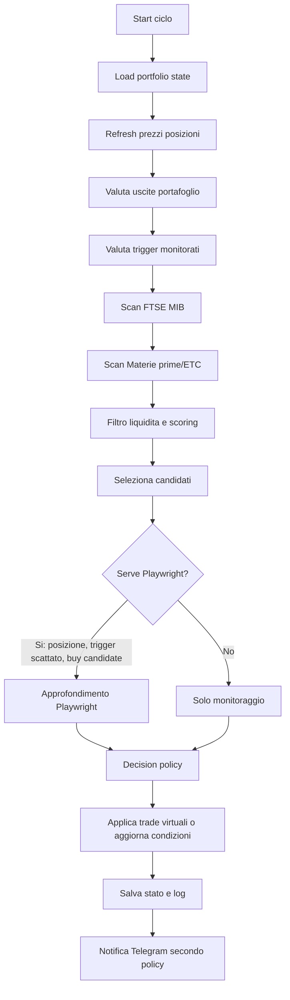
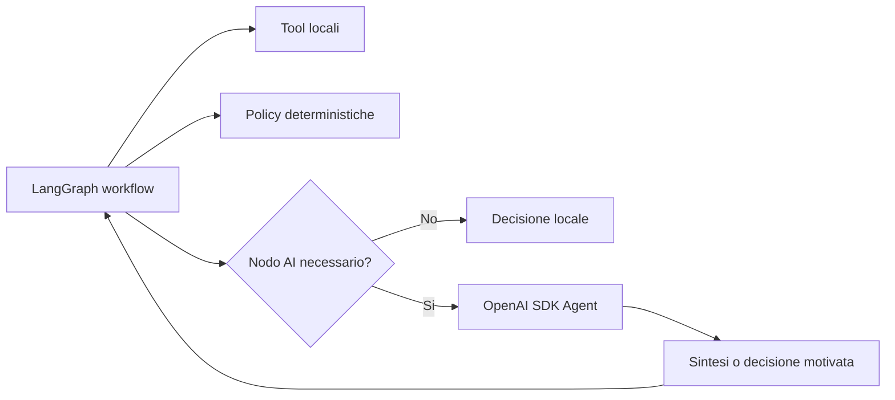

# Autonomous Trading Agent - Analisi architetturale LangGraph

Questo documento serve a ragionare prima di riscrivere il sistema. L'obiettivo non e sostituire subito l'agente esistente, ma capire quale architettura rende il progetto piu stabile, leggibile, osservabile e controllabile.

## Stato attuale

Il sistema oggi combina:

- scanner tecnici locali per FTSE MIB e Materie prime/ETC;
- portafoglio virtuale salvato su file JSON;
- condizioni monitorate e trigger di ingresso/uscita;
- analisi approfondite via Playwright/ChatGPT;
- agente OpenAI SDK per interpretare richieste utente e decidere operazioni;
- GUI React/FastAPI;
- bridge Telegram.

Il problema principale non e la mancanza di funzionalita, ma la difficolta a capire esattamente cosa succede in un ciclo:

- quali mercati sono stati analizzati;
- quali ticker sono stati scartati e perche;
- quali ticker sono diventati candidati;
- quando viene usato Playwright;
- quali decisioni sono state applicate al portafoglio;
- quali decisioni sono solo monitoraggio;
- perche un trigger e stato considerato scattato.

LangGraph puo aiutare soprattutto su questi punti.

## Principio guida

Separare chiaramente tre livelli:

1. **Dati e strumenti locali**
   Scanner, indicatori, liquidita, prezzi, portafoglio, performance, salvataggio file.

2. **Workflow deterministico**
   Sequenza dei passi: carica stato, scansiona mercati, filtra, valuta trigger, decide se approfondire, genera azioni.

3. **Ragionamento AI**
   Interpretazione, sintesi, confronto qualitativo, uso di news e grafici, spiegazione delle decisioni.

Il punto importante e che l'AI non dovrebbe essere responsabile di ricordare il flusso operativo. Il flusso deve essere nel grafo.

## Opzione A - LangGraph come orchestratore principale

In questa architettura LangGraph diventa il motore del ciclo operativo.

### Flusso possibile



### Vantaggi

- Ogni nodo ha responsabilita chiara.
- I log possono essere generati nodo per nodo.
- Si puo vedere dove il ciclo si ferma.
- Si riduce il rischio che l'agente faccia tool call troppe volte.
- Playwright puo essere protetto da policy deterministiche.
- La GUI puo mostrare lo stato del grafo: nodo corrente, ticker corrente, mercato corrente.

### Svantaggi

- Serve piu progettazione iniziale.
- Le decisioni autonome complesse richiedono una buona policy.
- Bisogna definire bene lo stato condiviso del grafo.

### Quando usarla

Questa e probabilmente la direzione migliore per il ciclo autonomo ogni 30 minuti.

## Opzione B - OpenAI SDK Agent come orchestratore principale

In questa architettura l'agente OpenAI SDK continua a decidere tutto e chiama tool.

### Vantaggi

- Piu flessibile nelle richieste in linguaggio naturale.
- Gia integrato nel progetto.
- Utile per chat Telegram e GUI.

### Svantaggi

- Il flusso operativo puo diventare opaco.
- Rischio di troppe tool call.
- Rischio `MaxTurnsExceeded`.
- Piu difficile garantire che analizzi FTSE MIB e Materie prime nello stesso ciclo.
- Piu difficile evitare Playwright su titoli non necessari.

### Quando usarla

Resta utile per richieste interattive:

- "cosa farai se Amplifon arriva a 11,33?";
- "spiegami perche hai comprato HER.MI";
- "mandami il grafico di A2A";
- "aggiungi Vodafone alla watchlist".

## Opzione C - Mix LangGraph + OpenAI SDK Agent

Questa e la soluzione piu equilibrata.

### Idea

LangGraph gestisce il ciclo operativo deterministico.
OpenAI SDK Agent viene usato come nodo specializzato quando serve ragionamento qualitativo.



### Esempi di nodi AI

- `explain_decision_node`
  Produce una spiegazione leggibile per Telegram/GUI.

- `qualitative_news_review_node`
  Valuta news gia raccolte via Playwright.

- `chart_interpretation_node`
  Usa l'output Playwright/ChatGPT del grafico, non rifà tutto da zero.

- `portfolio_rebalance_reasoning_node`
  Decide se ridurre, vendere o aumentare una posizione quando i dati tecnici sono gia stati preparati.

### Vantaggi

- Il ciclo e tracciabile.
- L'AI viene usata dove aggiunge valore.
- I tool costosi sono chiamati solo se una policy li abilita.
- Meno rischio di rate limit.
- Piu facile esporre lo stato nella GUI.

### Svantaggi

- Richiede disciplina: l'agente non deve bypassare il grafo.
- Bisogna definire bene input e output dei nodi AI.

## Policy Playwright proposta

Playwright non va usato su tutti i titoli.

Usarlo solo se almeno una condizione e vera:

- titolo gia in portafoglio;
- trigger di ingresso scattato;
- trigger di uscita vicino o scattato;
- buy candidate liquido con score tecnico sopra soglia;
- richiesta esplicita dell'utente;
- news necessarie per confermare o invalidare un trade.

Non usarlo per:

- titoli illiquidi;
- strumenti esclusi dal filtro liquidita;
- candidati con score basso;
- scan preliminare di tutto l'universo.

## Stato dati consigliato

Serve uno stato unico leggibile, ad esempio:

```text
portfolio.json
  positions
  cash
  monitored_conditions
  watchlist
  actions

output/state/agent_run_state.json
  current_status
  current_node
  current_market
  current_ticker
  last_started_at
  last_completed_at
  last_error
  next_expected_run

output/scans/ftse_mib_scan.json
output/scans/commodities_scan.json
output/runs/YYYYMMDD-HHMMSS-run.json
```

Il file `run.json` dovrebbe essere la fonte migliore per capire cosa e successo in un ciclo.

## Log consigliati

Ogni ciclo dovrebbe avere un `run_id`.

Esempio:

```text
2026-07-25 09:00:00 [run 20260725-090000] START scheduled
2026-07-25 09:00:02 [run 20260725-090000] market=FTSE_MIB scan start universe=40
2026-07-25 09:00:10 [run 20260725-090000] ticker=AMP.MI score=8 liquidity=ok candidate=yes reason="MACD sopra signal; DI+ sopra DI-"
2026-07-25 09:00:11 [run 20260725-090000] ticker=GBS.MI score=4 liquidity=low candidate=no reason="volume medio sotto soglia"
2026-07-25 09:00:30 [run 20260725-090000] playwright plan ticker=HER.MI reason="position open; exit review"
2026-07-25 09:01:20 [run 20260725-090000] action applied ticker=HER.MI action=buy_virtual_position amount=2000 reason="trigger pullback support confirmed"
2026-07-25 09:01:25 [run 20260725-090000] END ok duration=85s
```

La GUI dovrebbe leggere questi eventi e mostrarli come timeline, non solo come testo grezzo.

## Decisioni operative

L'agente autonomo puo comprare/vendere virtualmente, ma deve farlo con motivazioni salvate.

Ogni azione dovrebbe avere:

- ticker;
- mercato;
- tipo azione: buy, sell, reduce, hold, monitor;
- prezzo di riferimento;
- importo o percentuale;
- trigger che l'ha causata;
- dati tecnici principali;
- news usate;
- output Playwright se disponibile;
- motivo sintetico;
- timestamp;
- run_id.

## Come modellare ingresso su supporto

Oltre al breakout, serve uno scenario specifico:

### SCENARIO BREAKOUT

Ingresso se:

- close sopra trigger/resistenza;
- volumi in recupero o sopra media;
- news non negative;
- liquidita ok.

Stop:

- sotto livello rotto o supporto operativo.

### SCENARIO PULLBACK_SUPPORTO

Ingresso se:

- prezzo vicino al supporto;
- supporto non rotto in chiusura;
- compare reazione positiva;
- momentum smette di deteriorarsi;
- volumi non contrari;
- news non negative.

Stop:

- sotto supporto.

Target:

- ritorno verso resistenza/trigger breakout.

Il semplice fatto che il prezzo sia vicino al supporto non basta.

## GUI futura

La dashboard dovrebbe distinguere:

- **Portafoglio**
  Cosa possiedo ora e quale rischio sto correndo.

- **Azioni consigliate/applicate**
  Cosa ha deciso l'agente nell'ultimo ciclo.

- **Monitoraggio trigger**
  Solo condizioni vive e ordinate per urgenza.

- **Mercati**
  FTSE MIB e Materie prime separati, con score, liquidita, ultimo scan e motivi.

- **Run log**
  Timeline per run_id.

- **Telegram**
  Stato bot, ultima risposta, policy invio notifiche.

## Proposta di roadmap

### Fase 1 - Grafo osservabile

- Portare il ciclo monitor in LangGraph.
- Salvare `run_id` e timeline strutturata.
- Mantenere le operazioni virtuali disattivate o in dry-run.

### Fase 2 - Policy decisionale

- Formalizzare regole di ingresso/uscita.
- Applicare filtro hard liquidita.
- Separare breakout e pullback supporto.
- Usare Playwright solo su candidati qualificati.

### Fase 3 - Azioni autonome virtuali

- Abilitare buy/sell/reduce in portafoglio virtuale.
- Salvare motivazione completa.
- Inviare Telegram leggibile solo secondo policy.

### Fase 4 - Integrazione chat

- GUI e Telegram parlano con un agente OpenAI SDK.
- L'agente interattivo legge stato e run log.
- L'agente non esegue il ciclo autonomo direttamente: chiede al grafo o interroga i dati prodotti dal grafo.

## Raccomandazione

La direzione migliore sembra:

```text
LangGraph = motore operativo autonomo
OpenAI SDK Agent = interfaccia conversazionale e ragionamento qualitativo
Playwright/ChatGPT = analisi visuale/news solo su candidati qualificati
Tool locali = dati, indicatori, liquidita, portafoglio, logging
```

Questo dovrebbe ridurre confusione, token, blocchi, duplicazioni e comportamenti inattesi.

